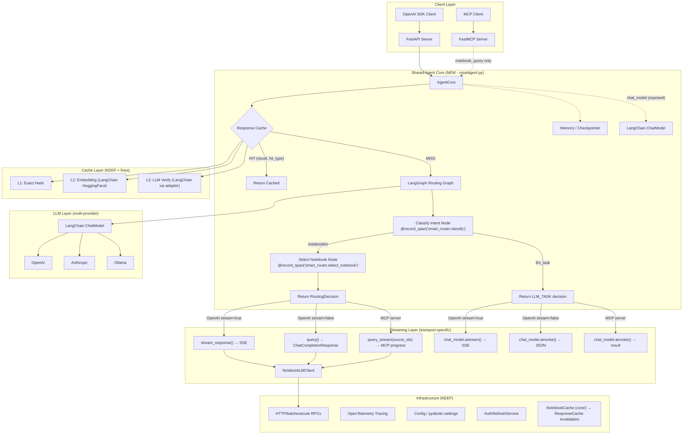

# LangChain/LangGraph Full Agentic Refactor — Design Document

## Goal

Refactor nlm-proxy to use **LangChain** (LLM abstraction, embeddings, prompt templates) and **LangGraph** (stateful agent graph with memory, tool-calling, multi-step reasoning) as the core orchestration framework. This replaces the hand-rolled OpenAI SDK calls, manual prompt formatting, and linear routing flow with a production-grade agentic architecture.

## Requirements (from brainstorming)

| Decision | Choice |
|----------|--------|
| **Scope** | Full agentic rewrite |
| **Cache strategy** | Hybrid — LangChain `Embeddings` replaces fastembed; keep custom L1/L2/L3 logic |
| **Capabilities** | Conversation memory, multi-step reasoning, tool-calling agent, cross-notebook query |
| **Migration** | Big bang — single branch, replace all at once |

---

## Current Architecture vs. Target

### Current Flow (linear)

```
User query
  → classify_request() [LLM call via raw OpenAI SDK]
  → if NOTEBOOKLM: select_notebook() [LLM call via raw OpenAI SDK]
  → query NotebookLM [HTTP batchexecute RPC]
  → return response
```

### Target Flow (LangGraph agent + four-phase pipeline)

```
User query + RequestOptions (bypass_cache, include_thinking, allowed_notebooks, conversation_id)
  Phase 0: Pre-routing cache check (global L1 exact match — skips everything on hit)
  Phase 1: LangGraph routing (decision only — NOT streaming)
    ├─ [conditional] classify intent (LangChain ChatModel)
    ├─ [conditional] select notebook (LangChain ChatModel + PromptTemplate)
    ├─ [tool call] list_notebooks / describe_notebook / describe_source
    ├─ ACL filtering (allowed_notebooks from request metadata)
    └─ Returns: RoutingDecision (request_type + notebook_id + cache_result if hit)
  Phase 2: Post-routing cache check (notebook-scoped L2/L3 semantic — only for NOTEBOOKLM)
  Phase 3a (streaming): Direct streaming (BYPASSES LangGraph — zero buffering)
    ├─ if NOTEBOOKLM: client.query_stream() → delta → SSE → client
    ├─ if LLM_TASK: agent.chat_model.astream() → SSE → client
    └─ After stream: accumulate response → cache.store() with embedding
  Phase 3b (non-streaming): Direct invoke
    ├─ if NOTEBOOKLM: client.query() → JSON response
    ├─ if LLM_TASK: agent.chat_model.ainvoke() → JSON response
    └─ After invoke: cache.store() with embedding
```

> [!IMPORTANT]
> #### Request Lifecycle — Features Preserved from Current Implementation
>
> | Feature | How Preserved |
> |---------|---------------|
> | **Per-request ACL** (`allowed_notebooks`) | Extracted from `request.metadata`, passed to agent, checked on cache hits |
> | **`bypass_cache`** | Checked before Phase 0 and Phase 2; skips both |
> | **`include_thinking`** | Passed to streaming layer for NLM thinking chunk filtering |
> | **`conversation_id`** | Loaded from session/memory, passed to `query_stream()` |
> | **`X-Cache-Status` header** | Set by transport layer: `HIT_PRE_ROUTING_EXACT`, `HIT_EXACT`, `HIT_SEMANTIC` |
> | **`system_fingerprint`** | Set on every chunk: `conv_{id}` (live) or `cache_{type}_conv_{id}` (cached) |
> | **Cache store after stream** | Response accumulated during streaming, stored with embedding post-stream |
> | **Direct notebook query** | When `model != router_model_name`, bypasses agent via `AgentCore.direct_query()`/`direct_stream()` |
> | **Non-streaming responses** | `ChatCompletionResponse` JSON returned for `stream=false` requests |
> | **MCP `source_ids` filtering** | Passed through `AgentCore.query_stream(source_ids=...)` |
> | **MCP `timeout` override** | Passed through `AgentCore.query(timeout=...)` |
> | **`_last_hit_type` → return value** | Cache lookup returns `(CachedResponse, hit_type)` tuple instead of side-channel |

> [!IMPORTANT]
> ### Streaming Architecture Constraint
>
> The current implementation uses a **zero-buffering direct-pipe pattern**: `client.query_stream()` yields cumulative chunks from NotebookLM's HTTP streaming endpoint, which are immediately delta-converted and yielded as OpenAI SSE chunks to the client. This gives users instant feedback (first token in ~2-3s).
>
> **The LangGraph agent must NOT wrap the NotebookLM streaming path.** LangGraph's `astream_events()` would buffer and re-emit events, adding latency and breaking the direct pipe. Instead:
>
> 1. **Phase 1 (LangGraph)**: Agent handles only the *routing decision* — classify intent, select notebook(s), resolve tools. This is a normal `ainvoke()` call that returns a `RoutingDecision`.
> 2. **Phase 3 (Direct response)**: The transport layer (FastAPI / MCP) takes the decision and responds directly:
>    - **Streaming**: `client.query_stream()` → SSE conversion → client (same as current `stream_response()` and `stream_smart_response()`)
>    - **Non-streaming**: `client.query()` → `ChatCompletionResponse` JSON (same as current non-streaming path in `handle_smart_routing()`)
>
> This two-phase design preserves the current streaming AND non-streaming behavior exactly while gaining LangGraph's agentic routing capabilities.

---

## Component-Level Analysis

### 1. `ExternalLLMClient` → LangChain `ChatModel`

**Current**: `core/llm_client.py` (93 lines) — raw `AsyncOpenAI` SDK with `complete()` and `stream()`.

**Target**: Replace with LangChain `ChatModel` abstraction. **Multi-provider from day one** — support OpenAI, Anthropic, Azure, Ollama via LangChain's provider packages.

| Aspect | Current | After LangChain |
|--------|---------|----|
| LLM init | `AsyncOpenAI(base_url, api_key)` | `init_chat_model(model, provider=...)` |
| Completion | `client.chat.completions.create()` | `model.ainvoke(messages)` |
| Streaming | `stream=True` → async iterator of `ChatCompletionChunk` | `model.astream(messages)` → async iterator of `AIMessageChunk` |
| Token params | Manual `max_tokens` vs `max_completion_tokens` | Handled by LangChain |
| Providers | OpenAI only | OpenAI, Anthropic, Azure, Ollama |

> [!WARNING]
> #### Callers of `ExternalLLMClient` (TWO distinct usages)
>
> `ExternalLLMClient` is instantiated in **two separate places** that must both be migrated:
>
> 1. **`SmartRouter.__init__()` → `router.py:62`** — creates `self.llm_client` used for `classify_request()` and `select_notebook()` calls, AND for LLM_TASK streaming via `router.llm_client.stream()` in `stream_smart_response()`.
> 2. **`main()` → `server.py:1064`** — creates a separate instance injected into `ResponseCache.__init__(llm_client=...)` for L3 semantic verification.
>
> After refactor: Both usages are replaced by a single `AgentCore.chat_model` (LangChain ChatModel). The `AgentCore` exposes `self.chat_model` as a property so the transport layer can use it for LLM_TASK streaming/completion.

> [!NOTE]
> #### `AIMessageChunk` vs `ChatCompletionChunk` format change
>
> The current `stream_smart_response()` reads OpenAI SDK chunks as `chunk.choices[0].delta.content`. After switching to LangChain `ChatModel.astream()`, chunks become `AIMessageChunk` objects with `chunk.content`. All streaming code that reads chunk content must be updated.

**Effort**: 🟢 Small — near 1:1 mapping + provider factory, ~1.5 days
**Files changed**: `core/llm_client.py` (rewrite), all callers updated

---

### 2. Prompt Templates → LangChain `PromptTemplate` / `ChatPromptTemplate`

**Current**: `openai/prompts/*.txt` — plain text files loaded via `load_prompt()`, formatted with `str.format()`.

**Target**: LangChain `PromptTemplate` with structured input variables.

| Prompt | Current File | LangChain Equivalent |
|--------|-------------|---------------------|
| classify_request | `prompts/classify_request.txt` | `ChatPromptTemplate` with `{query}` variable |
| select_notebook | `prompts/select_notebook.txt` | `ChatPromptTemplate` with `{notebooks_json}`, `{query}` |
| cache_verification | Inline in `response_cache.py` | `PromptTemplate` with `{new_query}`, `{cached_queries}` |

**Effort**: 🟢 Small — ~0.5 day
**Files changed**: `openai/prompts/__init__.py`, all 3 prompt files, `router.py`, `response_cache.py`

---

### 3. `SmartRouter` → LangGraph State Graph (routing decision only)

**Current**: `openai/router.py` (265 lines) — `SmartRouter` class with `classify_request()` → `select_notebook()` → `route()`.

**Target**: LangGraph `StateGraph` that produces a **routing decision** — it does NOT execute the query or handle streaming.

```python
from langgraph.graph import StateGraph, START, END
from typing import TypedDict
from dataclasses import dataclass

# --- Request context passed INTO the agent ---
@dataclass
class RequestOptions:
    bypass_cache: bool = False
    include_thinking: bool = True
    allowed_notebooks: list[str] | None = None  # Per-request ACL
    conversation_id: str | None = None           # NLM conversation continuity
    chat_id: str | None = None                   # Session identity
    source_ids: list[str] | None = None          # MCP: query specific sources
    timeout: float | None = None                 # MCP: per-request timeout

# --- Routing decision returned FROM the agent ---
@dataclass
class RoutingDecision:
    request_type: RequestType         # NOTEBOOKLM | LLM_TASK
    notebook_id: str | None           # Selected notebook
    reasoning: str                    # Human-readable explanation
    cache_result: CachedResponse | None = None  # Pre-filled on cache hit
    cache_hit_type: str | None = None  # "exact" | "semantic" | "pre_routing_exact"
    conversation_id: str | None = None  # Carried from session store

# --- LangGraph state (internal) ---
class RouterState(TypedDict):
    query: str
    messages: list                      # conversation history (from memory)
    request_type: str | None            # "notebooklm" | "llm_task"
    notebook_ids: list[str]             # selected notebook(s)
    reasoning: str
    available_notebooks: list[dict]     # fetched by tools
    allowed_notebooks: list[str] | None  # Per-request ACL filter

graph = StateGraph(RouterState)
graph.add_node("classify", classify_node)
graph.add_node("select_notebook", select_notebook_node)  # Respects allowed_notebooks
graph.add_node("resolve_cross_notebook", resolve_cross_notebook_node)

graph.add_edge(START, "classify")
graph.add_conditional_edges("classify", route_after_classify)
graph.add_edge("select_notebook", END)
graph.add_edge("resolve_cross_notebook", END)
```

> [!NOTE]
> The graph does **NOT** have `query_notebook` or `llm_passthrough` nodes.
> Streaming is handled outside the graph by the transport layer (see Section 8).

> [!NOTE]
> #### Tracing Span Migration
>
> **Current** spans created by `@record_span` decorator on SmartRouter methods:
> - `smart_router.classify`
> - `smart_router.select_notebook`
> - `smart_router.route`
>
> **After refactor**: LangGraph's `ainvoke()` creates its own internal spans when OTEL is configured. To preserve span names for existing monitoring dashboards:
> 1. Add explicit `@record_span("smart_router.classify")` to `classify_node()` function
> 2. Add explicit `@record_span("smart_router.select_notebook")` to `select_notebook_node()` function
> 3. The parent `smart_router.handle_request` span in `stream_smart_response()` stays as-is
>
> This ensures LangGraph's internal spans appear as *additional* children without breaking existing span names.

**Effort**: 🟡 Medium — restructure control flow, ~2-3 days
**Files changed**: `openai/router.py` (major rewrite), `openai/server.py` (integration)

---

### 4. `ResponseCache` L2/L3 → LangChain `Embeddings` Interface

**Current**: `core/response_cache.py` (834 lines) — `fastembed.TextEmbedding` + NumPy for L2, raw LLM call for L3.

**Target**: Replace `fastembed` with LangChain `Embeddings` interface. Keep all L1/L2/L3 logic intact.

| Layer | Current | After LangChain |
|-------|---------|----|
| L1 (exact) | SHA-256 hash — stays same | No change |
| L2 (embedding) | `fastembed.TextEmbedding.embed()` | `langchain.embeddings.HuggingFaceEmbeddings.embed_query()` |
| L2 (similarity) | NumPy dot product — stays same | No change |
| L3 (LLM verify) | `ExternalLLMClient.complete()` | LangChain `ChatModel.ainvoke()` via adapter |

> [!WARNING]
> #### L3 LLM Verification — Adapter Required
>
> The current `ResponseCache.__init__()` accepts `llm_client: object` and calls `self._llm_client.complete(prompt)` on it. After refactor, the LangChain ChatModel uses `.ainvoke(messages)` instead.
>
> **Solution**: Create an adapter or update `ResponseCache` L3 verification to accept a LangChain ChatModel directly:
>
> ```python
> # Option A: Adapter wrapping ChatModel to match existing .complete() interface
> class LangChainLLMAdapter:
>     def __init__(self, chat_model):
>         self.chat_model = chat_model
>     async def complete(self, prompt: str, max_tokens: int = 50) -> str:
>         response = await self.chat_model.ainvoke([HumanMessage(content=prompt)])
>         return response.content
>
> # Option B: Update ResponseCache to accept ChatModel directly (preferred)
> # Change _build_verification_prompt() to return a list of messages
> # Change _verify_semantic_match() to call chat_model.ainvoke(messages)
> ```

> [!WARNING]
> #### `_last_hit_type` Thread Safety Fix
>
> **Current**: After `lookup()` / `lookup_async()`, the cache stores hit type in `self._last_hit_type` (mutable instance field). The server reads it:
> ```python
> hit_type = app.state.response_cache._last_hit_type or "exact"
> ```
> This is a **race condition** — concurrent requests can overwrite each other's hit type.
>
> **Fix during refactor**: Return hit type as part of the lookup result:
> ```python
> # Before:
> cache_result = await response_cache.lookup_async(notebook_id, query)
> hit_type = response_cache._last_hit_type
>
> # After:
> cache_result, hit_type = await response_cache.lookup_async(notebook_id, query)
> # Returns (CachedResponse | None, str | None)
> ```

**Effort**: 🟢 Small — swap embedding provider + L3 adapter + thread safety fix, ~1.5 days
**Files changed**: `core/response_cache.py` (embedding methods + L3 verification + lookup return type)

---

### 5. `SessionStore` → LangGraph Memory / Checkpointing

**Current**: `openai/session.py` (183 lines) — in-memory dict `{chat_id → conversation_id}` with TTL + cleanup thread.

**Target**: LangGraph `MemorySaver` (dev) or `SqliteSaver` / `PostgresSaver` (production). Thread-scoped checkpoints manage conversation state automatically.

| Aspect | Current | After LangGraph |
|--------|---------|----------------|
| State storage | `dict` + `threading.Lock` | LangGraph checkpointer |
| Conversation history | NotebookLM `conversation_id` only | Full message history + `conversation_id` in state |
| TTL | Manual cleanup thread | Checkpointer handles with configurable TTL |
| Persistence | Lost on restart | SQLite/Postgres persists across restarts |

> [!WARNING]
> #### `conversation_id` ≠ LangGraph `thread_id`
>
> These are **different concepts** and must not be conflated:
>
> | Concept | Purpose |
> |---------|---------|
> | LangGraph `thread_id` | = `chat_id` from `X-OpenWebUI-Chat-Id` header / `metadata.chat_id`. Identifies the user session. Used by LangGraph checkpointer to scope memory. |
> | NLM `conversation_id` | An opaque token from NotebookLM's API, extracted from the first response chunk, passed to subsequent queries for conversation continuity within NotebookLM. |
>
> `conversation_id` must be stored **inside** the LangGraph state (as a field in `RouterState` or agent state), not replaced by the checkpointing system. The flow is:
>
> 1. LangGraph loads state for `thread_id=chat_id` (includes `conversation_id` from previous turn)
> 2. Agent passes `conversation_id` to `query_stream()` for NLM continuity
> 3. New `conversation_id` extracted from NLM response, saved back to state

**Effort**: 🟡 Medium — integrate checkpointer with existing FastAPI lifecycle, ~1-2 days
**Files changed**: `openai/session.py` (replace or wrap), `openai/server.py`

---

### 6. Tool-Calling Agent — NotebookLM as LangGraph Tools

**Current**: No tool-calling capability. Smart router hardcodes classify → select → query.

**Target**: Wrap key `NotebookLMClient` methods as LangGraph tools. Agent autonomously decides which tools to use.

#### Proposed Tool Set (read-only, safe for agent)

| Tool Name | Source Method | Description |
|-----------|-------------|-------------|
| `list_notebooks` | `client.list_notebooks()` | List available notebooks |
| `describe_notebook` | `client.notebook_describe()` | Get AI-generated notebook summary |
| `describe_source` | `client.source_describe()` | Get source summary + keywords |
| `query_notebook` | `client.query_stream()` | Query a specific notebook |
| `get_source_content` | `client.get_source_content()` | Get raw source text |
| `search_notebooks` | New: LLM-based | Find relevant notebooks for a topic |

#### Tools NOT exposed to agent (destructive operations)

- `notebook_create`, `notebook_delete`, `notebook_rename`
- `source_delete`, `source_sync_drive`
- `audio_overview_create`, `video_overview_create`, etc.
- `research_start`, `research_import`

**Effort**: 🟡 Medium — define tool schemas, wire to client, ~2 days
**Files changed**: New `core/tools.py` or `openai/tools.py`

---

### 7. Cross-Notebook Query Support

**Current**: Not implemented (listed in TODO.md).

**Target**: Agent queries multiple notebooks and synthesizes results using LLM.

```
User: "Compare the ML approaches described across my notebooks"
  → Agent identifies relevant notebooks (list + describe)
  → Queries each relevant notebook
  → Synthesizes results with LLM
```

This becomes natural with tool-calling agent — the agent can loop:
1. `list_notebooks()` → get all notebooks
2. `describe_notebook(id)` → check relevance
3. `query_notebook(id, query)` → get answers from each
4. Synthesize with final LLM call

**Effort**: 🟡 Medium — synthesis logic + prompt engineering, ~2 days
**Files changed**: New synthesis node in LangGraph, new prompt template

---

### 8. Integration: OpenAI Proxy Server (four-phase pipeline)

**Current**: `openai/server.py` (1158 lines) — FastAPI app with `handle_smart_routing()`, `chat_completions()`, streaming via `stream_response()` and `stream_smart_response()`.

**Target**: Four-phase request handling that preserves ALL current features including **both streaming and non-streaming paths**.

```python
# --- Construct request options from HTTP request ---
options = RequestOptions(
    bypass_cache=request.bypass_cache,
    include_thinking=request.include_thinking,
    allowed_notebooks=request.metadata.get("allowed_notebooks"),
    conversation_id=get_conversation_id(chat_id, session_store),
    chat_id=http_request.headers.get("X-OpenWebUI-Chat-Id") or request.metadata.get("chat_id"),
)

# --- Phase 0: Pre-routing global cache check (skips everything on hit) ---
if not options.bypass_cache:
    cache_result, hit_type = response_cache.lookup_global(query)
    if cache_result and acl_allows(cache_result.notebook_id, options.allowed_notebooks):
        if request.stream:
            return stream_cached(cache_result, hit_type=f"pre_routing_{hit_type}")
        else:
            return json_cached(cache_result, hit_type=f"pre_routing_{hit_type}")

# --- Direct notebook query (model != router_model_name) ---
if request.model != router_model_name:
    # Bypass agent entirely — query specific notebook with cache + session
    return await agent_core.handle_direct_query(request, options)

# --- Phase 1: Routing (LangGraph agent — non-streaming) ---
decision = await agent_core.route(query, options)

# --- Phase 2: Post-routing cache check (notebook-scoped, NOTEBOOKLM only) ---
if decision.request_type == NOTEBOOKLM and not options.bypass_cache:
    cache_result, hit_type = await response_cache.lookup_async(decision.notebook_id, query)
    if cache_result:
        if request.stream:
            return stream_cached(cache_result, hit_type, reasoning=decision.reasoning)
        else:
            return json_cached(cache_result, hit_type, reasoning=decision.reasoning)

# --- Phase 3: Direct response (with post-response cache storage) ---
if request.stream:
    # Phase 3a: Streaming
    if decision.request_type == NOTEBOOKLM:
        async for chunk in agent_core.query_stream(decision.notebook_id, query,
                                                    conversation_id=decision.conversation_id):
            # Delta conversion, include_thinking filter, session save — SAME as current
            yield openai_sse_chunk(chunk)
        # Store in cache with embedding after stream completes
        response_cache.store(notebook_id, query, accumulated_answer, thinking, conv_id, embedding)
    else:  # LLM_TASK
        async for chunk in agent_core.chat_model.astream(messages):
            # AIMessageChunk → OpenAI SSE format conversion
            yield openai_sse_chunk_from_ai_message(chunk)
else:
    # Phase 3b: Non-streaming
    if decision.request_type == NOTEBOOKLM:
        result = await agent_core.query(decision.notebook_id, query,
                                         conversation_id=decision.conversation_id)
        response_text = result.get("answer", "")
        # Store in cache, save session, return ChatCompletionResponse
    else:  # LLM_TASK
        response = await agent_core.chat_model.ainvoke(messages)
        response_text = response.content
        # Return ChatCompletionResponse
```

| Endpoint | Change |
|----------|--------|
| `POST /v1/chat/completions` | Four-phase pipeline; both streaming and non-streaming; direct notebook query preserved |
| `GET /v1/models` | No change |
| `GET /v1/cache/stats` | No change |
| Streaming | **PRESERVED** — `query_stream()` pipes directly to client |
| Non-streaming | **PRESERVED** — `client.query()` returns JSON, wrapped in `ChatCompletionResponse` |
| Cache signals | `X-Cache-Status` header set on all cache hits (both stream and non-stream) |
| `system_fingerprint` | `conv_{id}` (live) or `cache_{type}_conv_{id}` (cached) |

> [!IMPORTANT]
> **Three code paths remain** as in the current implementation:
> 1. **Smart router path, streaming** (`model == router_model_name`, `stream=true`): uses the LangGraph agent → SSE streaming
> 2. **Smart router path, non-streaming** (`model == router_model_name`, `stream=false`): uses the LangGraph agent → `ChatCompletionResponse` JSON
> 3. **Direct notebook path** (`model == notebook_id`): bypasses agent, queries notebook directly with cache + session (both streaming and non-streaming via `AgentCore.handle_direct_query()`)
>
> All paths share cache logic, session management, and `X-Cache-Status` headers.

**Effort**: 🔴 Large — rewire routing + verify streaming AND non-streaming parity, ~3-4 days
**Files changed**: `openai/server.py` (`handle_smart_routing()` rewrite, streaming functions kept)

---

### 9. MCP Server Unification (shared agent core)

**Current**: `mcp/server.py` (2121 lines) — standalone FastMCP tools using `NotebookLMClient` directly. `notebook_query` and `notebook_query_stream` bypass all routing, caching, and agent logic.

**Target**: Both MCP and OpenAI proxy share a **common agent core module** (`core/agent.py`).

```
BEFORE:                          AFTER:
┌────────────┐                   ┌────────────┐
│OpenAI Proxy│──→ SmartRouter    │OpenAI Proxy│──┐
└────────────┘    + cache         └────────────┘  │    ┌─────────────────┐
                                                  ├──→ │  core/agent.py  │
┌────────────┐                   ┌────────────┐  │    │  (LangGraph +   │
│ MCP Server │──→ raw client     │ MCP Server │──┘    │   cache + tools) │
└────────────┘                   └────────────┘       └─────────────────┘
```

#### Shared Agent Core (`core/agent.py`)

```python
class AgentCore:
    """Shared agent logic for both OpenAI proxy and MCP server."""

    def __init__(self, nlm_client, notebook_cache, response_cache, config):
        self.nlm_client = nlm_client
        self.notebook_cache = notebook_cache
        self.response_cache = response_cache
        self.routing_graph = build_routing_graph(config)
        self.chat_model = init_chat_model(config)   # Exposed for LLM_TASK streaming
        self.checkpointer = init_checkpointer(config)

        # Wire source-change detection → cache invalidation
        if notebook_cache and response_cache:
            notebook_cache._on_sources_changed = response_cache.invalidate_notebook

    async def route(self, query: str, options: RequestOptions) -> RoutingDecision:
        """Get routing decision (used by both interfaces)."""
        # Phase 0: Pre-routing global L1 cache check
        if not options.bypass_cache and self.response_cache:
            cached, hit_type = self.response_cache.lookup_global(query)
            if cached and self._acl_allows(cached.notebook_id, options.allowed_notebooks):
                return RoutingDecision(
                    request_type=RequestType.NOTEBOOKLM,
                    notebook_id=cached.notebook_id,
                    reasoning="Pre-routing cache hit",
                    cache_result=cached,
                    cache_hit_type=f"pre_routing_{hit_type}",
                    conversation_id=options.conversation_id,
                )

        # Phase 1: LangGraph routing
        state = await self.routing_graph.ainvoke(
            {"query": query, "allowed_notebooks": options.allowed_notebooks},
            config={"configurable": {"thread_id": options.chat_id}},
        )
        return RoutingDecision(
            request_type=state["request_type"],
            notebook_id=state["notebook_ids"][0] if state["notebook_ids"] else None,
            reasoning=state["reasoning"],
            conversation_id=options.conversation_id,
        )

    async def query(self, notebook_id, query, conversation_id=None,
                    source_ids=None, timeout=None) -> dict:
        """Non-streaming query from NotebookLM (used by MCP notebook_query and non-streaming path)."""
        return await self.nlm_client.query(
            notebook_id, query_text=query,
            conversation_id=conversation_id,
            source_ids=source_ids,
            timeout=timeout,
        )

    async def query_stream(self, notebook_id, query, conversation_id=None,
                           source_ids=None, **kwargs):
        """Direct streaming from NotebookLM (shared by both interfaces)."""
        async for chunk in self.nlm_client.query_stream(
            notebook_id, query_text=query,
            conversation_id=conversation_id,
            source_ids=source_ids,
            **kwargs
        ):
            yield chunk

    async def handle_direct_query(self, request, options):
        """Handle direct notebook query (model == notebook_id, bypasses routing).

        Handles cache check, NLM query, session save, cache store
        for both streaming and non-streaming paths.
        Used by OpenAI proxy when model != router_model_name.
        """
        # Cache check (L1+L2+L3)
        if not options.bypass_cache and self.response_cache:
            cache_result, hit_type = await self.response_cache.lookup_async(
                request.model, query
            )
            if cache_result:
                return cache_result, hit_type  # Caller handles format

        # Query NLM directly (streaming or non-streaming handled by caller)
        # ... delegate to query() or query_stream() based on request.stream
```

#### MCP Server Changes

| MCP Tool | Current | After |
|----------|---------|-------|
| `notebook_query` | `client.query()` directly | `agent.route()` → `agent.query()` with `source_ids` + `timeout` |
| `notebook_query_stream` | `client.query_stream()` directly | `agent.route()` → `agent.query_stream()` with `source_ids` |
| All other tools | `client.*()` directly | No change — read/write tools stay direct |

> [!NOTE]
> Only `notebook_query` and `notebook_query_stream` route through the agent.
> All other MCP tools (create, delete, research, studio, etc.) continue using `NotebookLMClient` directly since they are direct CRUD operations, not knowledge queries.

> [!WARNING]
> #### MCP Integration Pattern
>
> The MCP server currently uses a **global `_client` singleton** pattern (not dependency injection). The `AgentCore` must be initialized similarly:
>
> ```python
> # mcp/server.py
> _agent_core: AgentCore | None = None
>
> async def get_agent_core() -> AgentCore:
>     global _agent_core
>     if _agent_core is None:
>         client = await get_client()  # Existing pattern
>         _agent_core = AgentCore(nlm_client=client, ...)
>     return _agent_core
> ```
>
> The MCP `notebook_query_stream` also uses `ctx.report_progress()` for MCP progress updates. This must be preserved as a transport-layer concern:
>
> ```python
> @logged_tool()
> async def notebook_query_stream(notebook_id, query, source_ids=None,
>                                  conversation_id=None, ctx=None):
>     agent = await get_agent_core()
>     options = RequestOptions(conversation_id=conversation_id, source_ids=source_ids)
>     decision = await agent.route(query, options)
>     async for chunk in agent.query_stream(decision.notebook_id, query, ...):
>         if ctx:  # MCP progress reporting — transport-layer concern
>             await ctx.report_progress(...)
>         ...
> ```

**Effort**: 🟡 Medium — extract shared agent core, rewire MCP query tools, ~2-3 days
**Files changed**: New `core/agent.py`, `mcp/server.py` (query tools only), `openai/server.py`

---

### 10. Configuration Changes

**Current**: `core/config.py` — `SmartRoutingSettings` (14 fields, `NLM_PROXY_ROUTING_` prefix) + `CacheSettings` (8 fields, `NLM_PROXY_CACHE_` prefix).

**Target**: Add `AgentSettings` for LangChain-specific settings. **Keep `SmartRoutingSettings` and `CacheSettings` backward-compatible** — do NOT change their env prefixes.

> [!IMPORTANT]
> #### Environment Variable Backward Compatibility
>
> Existing users have configured `.env` files with `NLM_PROXY_ROUTING_*` and `NLM_PROXY_CACHE_*` variables. Changing these prefixes would break all deployments.
>
> **Strategy**: Add new `AgentSettings` with `NLM_PROXY_AGENT_` prefix for LangChain-specific settings. Migrate shared fields via property accessors that read from both old and new settings. Existing env vars continue to work.

```python
class AgentSettings(BaseSettings):
    """LangChain/LangGraph-specific configuration (NEW — additive, not replacing)."""

    # LLM provider (multi-provider from day one)
    llm_provider: str = "openai"           # openai | anthropic | azure | ollama
    # NOTE: llm_model, llm_base_url, llm_api_key, llm_temperature
    # are read from SmartRoutingSettings for backward compat

    # Embedding provider
    embedding_provider: str = "huggingface"  # huggingface | openai | cohere
    # NOTE: embedding_model is read from CacheSettings.embedding_model for backward compat

    # Memory
    memory_backend: str = "memory"         # memory | sqlite | postgres
    memory_db_path: str = "~/.nlm-proxy/memory.db"

    # Agent behavior
    agent_max_iterations: int = 10
    agent_verbose: bool = False
    agent_fallback_on_error: bool = True   # Fall back to direct routing on agent failure

    model_config = SettingsConfigDict(
        env_prefix="NLM_PROXY_AGENT_",
        env_file=_get_env_files(),
        env_file_encoding="utf-8",
        extra="ignore",
    )


# SmartRoutingSettings (KEPT — all 14 fields preserved, same env prefix)
# All existing NLM_PROXY_ROUTING_* env vars continue to work:
#   router_model_name, llm_base_url, llm_api_key, llm_model,
#   allowed_notebooks, summary_cache_ttl, source_fetch_concurrency,
#   max_source_titles, source_descriptions_enabled, source_max_keywords,
#   source_summary_max_chars, source_descriptions_max_sources

# CacheSettings (KEPT — all 8 fields preserved, same env prefix)
# All existing NLM_PROXY_CACHE_* env vars continue to work:
#   response_cache_enabled, response_cache_ttl, response_cache_max_entries,
#   semantic_match_enabled, embedding_model, similarity_threshold,
#   similarity_exact_threshold, semantic_match_top_k
```

**Field mapping for AgentCore initialization**:

| AgentCore needs | Source | Env var |
|---|---|---|
| `llm_provider` | AgentSettings | `NLM_PROXY_AGENT_LLM_PROVIDER` |
| `llm_model` | SmartRoutingSettings | `NLM_PROXY_ROUTING_LLM_MODEL` (unchanged) |
| `llm_base_url` | SmartRoutingSettings | `NLM_PROXY_ROUTING_LLM_BASE_URL` (unchanged) |
| `llm_api_key` | SmartRoutingSettings | `NLM_PROXY_ROUTING_LLM_API_KEY` (unchanged) |
| `embedding_model` | CacheSettings | `NLM_PROXY_CACHE_EMBEDDING_MODEL` (unchanged) |
| `embedding_provider` | AgentSettings | `NLM_PROXY_AGENT_EMBEDDING_PROVIDER` |
| `memory_backend` | AgentSettings | `NLM_PROXY_AGENT_MEMORY_BACKEND` |
| `router_model_name` | SmartRoutingSettings | `NLM_PROXY_ROUTING_ROUTER_MODEL_NAME` (unchanged) |
| `allowed_notebooks` | SmartRoutingSettings | `NLM_PROXY_ROUTING_ALLOWED_NOTEBOOKS` (unchanged) |

**Effort**: 🟢 Small — ~0.5 day
**Files changed**: `core/config.py` (add `AgentSettings`, keep existing classes)

---

### 11. `NotebookCache` → move to `core/` (shared component)

**Current**: `openai/notebook_cache.py` — located in `openai/` package, used only by OpenAI proxy.

**Target**: Move to `core/notebook_cache.py` since both MCP and OpenAI proxy share the `AgentCore` which depends on it.

> [!NOTE]
> #### Bidirectional wiring pattern (preserved from current)
>
> The current `main()` in `server.py` has a complex initialization sequence:
> 1. Create `NotebookLMClient` with `notebook_cache=None`
> 2. Wire `on_sources_changed` callback: `ResponseCache.invalidate_notebook`
> 3. Create `NotebookCache(nlm_client=..., on_sources_changed=...)`
> 4. Back-wire: `nlm_client._notebook_cache = notebook_cache`
>
> In the new architecture, `AgentCore.__init__()` handles all of this:
> ```python
> class AgentCore:
>     def __init__(self, nlm_client, notebook_cache, response_cache, config):
>         self.nlm_client = nlm_client
>         self.notebook_cache = notebook_cache
>         self.response_cache = response_cache
>         # Wire bidirectional dependencies
>         if notebook_cache and response_cache:
>             notebook_cache._on_sources_changed = response_cache.invalidate_notebook
>         if nlm_client and notebook_cache:
>             nlm_client._notebook_cache = notebook_cache
> ```
>
> The **caller** (either `server.py main()` or MCP server) creates the `NotebookLMClient` and `NotebookCache` instances, then passes them to `AgentCore`.

**Effort**: 🟢 Small — file move + import updates, ~0.5 day
**Files changed**: `openai/notebook_cache.py` → `core/notebook_cache.py`, update all imports

---

## Dependency Changes

### New Dependencies

```toml
[project.dependencies]
# ADD
"langchain>=0.3",
"langchain-openai>=0.3",
"langchain-anthropic>=0.3",        # Multi-provider day one
"langchain-community>=0.3",
"langgraph>=0.3",
"langgraph-checkpoint>=2.0",
# Optional backends
# "langgraph-checkpoint-sqlite" -- for persistent memory
# "langgraph-checkpoint-postgres" -- for production
# "langchain-ollama" -- for local models

# KEEP
"httpx>=0.27.0",
"pydantic-settings>=2.0.0",
"fastapi>=0.100.0",
"uvicorn>=0.23.0",
"fastmcp>=0.1.0",
"numpy>=1.24",
"openai>=1.0.0",           # KEEP — used by LLM streaming path (AIMessageChunk ≠ OpenAI chunk)
# OpenTelemetry deps -- keep as-is

# REMOVE
# "fastembed>=0.4" -- replaced by langchain embeddings
```

### GPU Embedding Support

```toml
[project.optional-dependencies]
# BEFORE:
# cache-gpu = ["fastembed-gpu>=0.4", "numpy>=1.24"]

# AFTER: GPU support via LangChain HuggingFace embeddings
# HuggingFaceEmbeddings automatically uses GPU when torch+CUDA is available.
# No separate GPU package needed — users install torch with CUDA instead:
# pip install torch --index-url https://download.pytorch.org/whl/cu121
cache-gpu = ["torch>=2.0"]  # Enables GPU for HuggingFaceEmbeddings
```

---

## Lifecycle Changes

### Per-request → Singleton `SmartRouter`

**Current**: `handle_smart_routing()` creates a **new `SmartRouter` instance per request** (line 306-313), which creates a new `ExternalLLMClient` (with a new `AsyncOpenAI` connection) each time. After the request, `router.close()` is called.

**After refactor**: `AgentCore` is a **long-lived singleton** initialized at startup (in `main()` or MCP startup). No per-request creation or teardown. Benefits:
- Reuse LLM connections across requests
- LangGraph checkpointer persists across requests
- Embedding model loaded once

**Teardown**: Graceful shutdown in `main()` finally block instead of per-request close.

---

## Task Estimate Summary

| # | Task | Effort | Days | Risk |
|---|------|--------|------|------|
| 1 | Replace `ExternalLLMClient` with LangChain `ChatModel` (multi-provider) + expose for streaming | Small | 1.5 | 🟢 Low |
| 2 | Convert prompt templates to LangChain `PromptTemplate` | Small | 0.5 | 🟢 Low |
| 3 | Refactor `SmartRouter` into LangGraph `StateGraph` (routing only) + tracing spans | Medium | 2-3 | 🟡 Medium |
| 4 | Replace `fastembed` with LangChain `Embeddings` + L3 adapter + `_last_hit_type` fix | Small | 1.5 | 🟢 Low |
| 5 | Replace `SessionStore` with LangGraph memory/checkpointing | Medium | 1-2 | 🟡 Medium |
| 6 | Create tool-calling agent with NotebookLM tools | Medium | 2 | 🟡 Medium |
| 7 | ~~Cross-notebook query synthesis~~ | ~~Medium~~ | — | Deferred |
| 8 | Rewire OpenAI proxy server (four-phase pipeline, streaming + non-streaming) | Large | 3-4 | 🔴 High |
| 9 | **Extract shared agent core** + MCP server unification (with `source_ids`/`timeout`) | Medium | 2-3 | 🟡 Medium |
| 10 | Configuration updates (`AgentSettings` additive, backward compat) | Small | 0.5 | 🟢 Low |
| 11 | Move `NotebookCache` to `core/` + bidirectional wiring docs | Small | 0.5 | 🟢 Low |
| 12 | Update all tests (see test migration plan below) | Medium | 2-3 | 🟡 Medium |
| 13 | Update documentation (README, architecture docs, GEMINI.md, `.env.example`) | Small | 1 | 🟢 Low |
| | **Total (big bang)** | | **~18-24 days** | |

---

## Test Migration Plan

### Tests Requiring Full Rewrite

| Test File | Size | Reason |
|---|---|---|
| `tests/core/test_llm_client.py` | 3 KB | `ExternalLLMClient` class removed — replace with LangChain ChatModel tests |
| `tests/test_openai_module/test_router.py` | 5 KB | `SmartRouter` class replaced by LangGraph StateGraph |
| `tests/test_openai_module/test_router_acl.py` | 10 KB | ACL filtering moves to LangGraph node — rewrite with new patterns |

### Tests Requiring Mock Updates

| Test File | Size | What changes |
|---|---|---|
| `tests/core/test_response_cache.py` | 15 KB | Replace `fastembed` mocks → LangChain `Embeddings` mocks; update `lookup()` return type to tuple |
| `tests/core/test_response_cache_semantic.py` | 5 KB | Replace `fastembed.TextEmbedding` mocks → `HuggingFaceEmbeddings` mocks |
| `tests/core/test_response_cache_llm.py` | 6 KB | Replace `ExternalLLMClient.complete()` mocks → `ChatModel.ainvoke()` mocks |
| `tests/core/test_embedding_models.py` | 4 KB | Validate LangChain `HuggingFaceEmbeddings` behavior instead of `fastembed` |
| `tests/core/test_response_cache_integration.py` | 5 KB | Update integration mocks |

### Tests Unchanged

| Test File | Reason |
|---|---|
| `tests/test_config.py` | Config structure preserved (backward compat) |
| `tests/test_auth_refresh.py` | Auth system unchanged |
| `tests/core/test_tracing_*.py` | Tracing infrastructure unchanged |
| `tests/test_openai_module/test_notebook_cache.py` | NotebookCache logic unchanged (just moved) |
| `tests/test_openai_module/test_prompts.py` | Prompt loading may need minor updates |
| `tests/test_openai_module/test_conversation_flow.py` | Session semantics change — review needed |
| `tests/test_openai_module/test_server.py` | Endpoint tests — adapt to AgentCore |

### New Tests Needed

| Test | Description |
|---|---|
| `tests/core/test_agent.py` | `AgentCore.route()`, `query()`, `query_stream()`, `handle_direct_query()` |
| `tests/core/test_agent_integration.py` | End-to-end: route → cache check → query → cache store |
| `tests/test_openai_module/test_non_streaming.py` | Verify non-streaming path with ChatCompletionResponse |

---

## Risk Assessment

| Risk | Impact | Mitigation |
|------|--------|------------|
| ~~**LangGraph streaming**~~ | ~~🔴 High~~ | **MITIGATED** — two-phase design keeps streaming outside LangGraph |
| **Memory overhead** — LangChain adds significant dependencies | 🟡 Medium | Benchmark startup time and memory |
| **Regression** — big bang replacement of working code | 🔴 High | Comprehensive test suite before refactor |
| **LangChain versioning** — rapid changes in LangChain ecosystem | 🟡 Medium | Pin versions, monitor changelogs |
| **fastembed removal** — current embedding model may behave differently via LangChain wrapper | 🟡 Medium | Run embedding comparison tests |
| **Tool-calling latency** — agent may make unnecessary tool calls | 🟡 Medium | Limit `max_iterations`, tune prompts |
| **MCP + OpenAI divergence** — shared agent core must serve two different interfaces | 🟡 Medium | Clean interface boundary: `AgentCore` returns decisions, callers handle transport |
| **Cross-notebook streaming** — multi-notebook queries need sequential streaming or synthetic response | 🟡 Medium | Deferred to later design |
| **Non-streaming regression** — non-streaming path must return proper `ChatCompletionResponse` | 🟡 Medium | Dedicated test suite for non-streaming |
| **Env var migration** — changed prefixes break deployments | 🟢 Low | **MITIGATED** — backward compat strategy keeps existing prefixes |

---

## Architecture Diagram



---

## Infrastructure Components (unchanged)

These components are **NOT part of the LangChain refactor** but must be preserved:

| Component | Status | Notes |
|-----------|--------|-------|
| `AuthRefreshService` | KEEP | Background CSRF/cookie refresh. Starts in `main()`, runs as daemon thread. |
| `NotebookCache.on_sources_changed` | KEEP | Callback wired to `ResponseCache.invalidate_notebook()` in `AgentCore.__init__()`. Bidirectional wiring with `nlm_client._notebook_cache` also in `AgentCore.__init__()`. |
| `OpenTelemetry tracing` | KEEP | `instrument_fastapi()`, `instrument_httpx()`, manual spans in streaming. LangGraph nodes use `@record_span()` to preserve existing span names. |
| `verify_api_key` dependency | KEEP | FastAPI `Depends()` on all endpoints. |
| `/health` endpoint | KEEP | No auth required. |
| `Pydantic types` (`types.py`) | KEEP | `ChatCompletionRequest`, `ChatCompletionChunk`, `ChatCompletionResponse` — all preserved. Custom extensions (`bypass_cache`, `include_thinking`, `metadata`) must remain. |

> [!NOTE]
> #### OpenTelemetry + LangGraph Span Interaction
>
> LangGraph's `ainvoke()` creates internal spans when OTEL is configured. These will appear inside the existing `smart_router.handle_request` span as child spans. Additionally, explicit `@record_span()` decorators on LangGraph node functions preserve the existing span names (`smart_router.classify`, `smart_router.select_notebook`), ensuring monitoring dashboards continue to work.
>
> Manual spans in `stream_response()` / `stream_smart_response()` stay as-is since they cover Phase 3 (streaming), which is outside LangGraph.

---

## Decisions Log

| # | Question | Decision |
|---|----------|----------|
| 1 | LLM Provider flexibility | ✅ Multi-provider from day one (OpenAI, Anthropic, Ollama) |
| 2 | Streaming protocol | ✅ **RESOLVED** — two-phase design, streaming outside LangGraph |
| 3 | Fallback behavior | ✅ `agent_fallback_on_error = True` — agent failures fall back to direct classify→select→query |
| 4 | MCP server future | ✅ Unify — shared `AgentCore` used by both OpenAI proxy and MCP |
| 5 | Cross-notebook streaming | 📋 **Deferred** — design later |
| 6 | Non-streaming path | ✅ **RESOLVED** — both streaming and non-streaming documented in Phase 3a/3b |
| 7 | Config migration | ✅ **RESOLVED** — backward compat: keep existing env prefixes, add new `AgentSettings` |
| 8 | `_last_hit_type` thread safety | ✅ **RESOLVED** — return `(CachedResponse, hit_type)` tuple from lookup |
| 9 | MCP `source_ids`/`timeout` | ✅ **RESOLVED** — passed through `RequestOptions` and `AgentCore` methods |
| 10 | `ExternalLLMClient` dual usage | ✅ **RESOLVED** — both replaced by single `AgentCore.chat_model` |
| 11 | Tracing span names | ✅ **RESOLVED** — `@record_span()` on LangGraph nodes preserves existing names |
| 12 | `NotebookCache` location | ✅ **RESOLVED** — move to `core/` for shared access |
