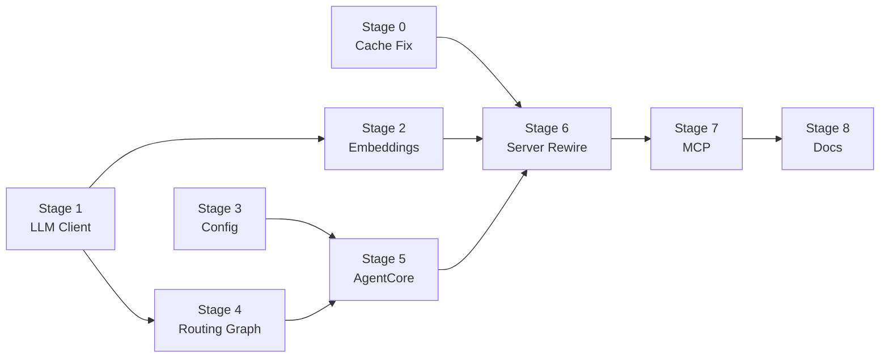

# LangChain/LangGraph Refactor — Master Plan

> **For Claude:** REQUIRED SUB-SKILL: Use superpowers:executing-plans to implement each stage plan file individually.

**Goal:** Refactor nlm-proxy to use LangChain (LLM abstraction, embeddings) and LangGraph (stateful routing graph) while preserving all existing features through staged migration with full test coverage.

**Architecture:** Nine-stage migration with checkpoints. Each stage is a self-contained, testable unit. Earlier stages handle low-risk foundation swaps; later stages tackle the high-risk server rewiring and MCP unification.

**Tech Stack:** LangChain ≥1.2, LangGraph ≥1.0, langchain-openai ≥1.1, langchain-huggingface ≥1.2, langgraph-checkpoint ≥4.0. **Requires Python ≥3.10.**

**Design Document:** [2026-03-03-langchain-refactor-design.md](file:///d:/latuan/Programming/nlm-proxy/docs/plans/2026-03-03-langchain-refactor-design.md)

---

## Stage Overview

| Stage | Plan File | Focus | Risk | Depends On |
|-------|-----------|-------|------|------------|
| **0** | [stage0-cache-fix](file:///d:/latuan/Programming/nlm-proxy/docs/plans/2026-03-03-langchain-refactor-stage0-cache-fix.md) | Fix `_last_hit_type` thread safety | 🟢 Low | — |
| **1** | [stage1-llm-client](file:///d:/latuan/Programming/nlm-proxy/docs/plans/2026-03-03-langchain-refactor-stage1-llm-client.md) | Replace `ExternalLLMClient` → LangChain ChatModel | 🟢 Low | — |
| **2** | [stage2-embeddings](file:///d:/latuan/Programming/nlm-proxy/docs/plans/2026-03-03-langchain-refactor-stage2-embeddings.md) | Replace `fastembed` → LangChain Embeddings + L3 adapter | 🟢 Low | Stage 1 |
| **3** | [stage3-config](file:///d:/latuan/Programming/nlm-proxy/docs/plans/2026-03-03-langchain-refactor-stage3-config.md) | Add `AgentSettings` + move `NotebookCache` to `core/` | 🟢 Low | — |
| **4** | [stage4-routing-graph](file:///d:/latuan/Programming/nlm-proxy/docs/plans/2026-03-03-langchain-refactor-stage4-routing-graph.md) | LangGraph routing graph (classify + select notebook) | 🟡 Medium | Stage 1 |
| **5** | [stage5-agent-core](file:///d:/latuan/Programming/nlm-proxy/docs/plans/2026-03-03-langchain-refactor-stage5-agent-core.md) | Create `AgentCore` orchestration layer | 🟡 Medium | Stages 1, 3, 4 |
| **6** | [stage6-server-rewire](file:///d:/latuan/Programming/nlm-proxy/docs/plans/2026-03-03-langchain-refactor-stage6-server-rewire.md) | Rewire OpenAI proxy → four-phase pipeline | 🔴 High | Stages 0–5 |
| **7** | [stage7-mcp](file:///d:/latuan/Programming/nlm-proxy/docs/plans/2026-03-03-langchain-refactor-stage7-mcp.md) | MCP server unification (shared `AgentCore`) | 🟡 Medium | Stage 6 |
| **8** | [stage8-docs-cleanup](file:///d:/latuan/Programming/nlm-proxy/docs/plans/2026-03-03-langchain-refactor-stage8-docs-cleanup.md) | Documentation + dead code removal | 🟢 Low | Stage 7 |

## Dependency Graph



> [!TIP]
> **Parallelizable stages:** Stage 0, Stage 1, and Stage 3 have no dependencies and can be executed in parallel. Stage 2 and Stage 4 can also run in parallel once Stage 1 is complete.

---

## Validation Rule

> [!IMPORTANT]
> After completing each stage: run `uv run pytest -v`. ALL tests must pass before proceeding to the next stage.

---

## Deferred Items

The following items from the design document are **explicitly deferred**:

### SessionStore → LangGraph Memory (Design Section 5)

**Rationale**: The current `SessionStore` is simple and works correctly. Replacing it with LangGraph `MemorySaver`/`SqliteSaver` adds complexity without immediate benefit. The `AgentCore` already passes `thread_id` to `routing_graph.ainvoke()` to enable this later.

### Tool-Calling Agent (Design Section 6)

**Rationale**: Wrapping `NotebookLMClient` methods as LangGraph tools for autonomous agent use is a **new feature**, not a refactor. This plan focuses on replacing existing components while preserving all current behavior.

### Cross-Notebook Query (Design Section 7)

Already marked as deferred in the design document.

---

## Verification Plan

### Automated Tests

After EACH stage:
```bash
uv run pytest -v
```

Full regression after all stages:
```bash
uv run pytest -v --tb=long
```

### Manual Verification

> [!IMPORTANT]
> Manual testing requires a configured `.env` with valid auth tokens and LLM API keys. Run after Stage 6.

1. **Smart routing streaming**: Send query to `knowledge-finder` model, verify SSE stream
2. **Smart routing non-streaming**: Send `stream=false` request, verify JSON response
3. **Direct notebook query**: Send query with `model=<notebook-id>`, verify bypass
4. **Cache hit**: Send same query twice, verify `X-Cache-Status` header on second
5. **LLM_TASK**: Send "write a poem" to `knowledge-finder`, verify LLM passthrough
6. **MCP query**: Use MCP client to call `notebook_query_stream`, verify progress reporting

---

## Risk Mitigations

| Risk | Mitigation |
|------|------------|
| Stages 5-6 break streaming | Keep `query_stream()` direct pipe unchanged |
| LangChain version conflicts | Pin `langchain>=1.2,<2.0` |
| fastembed → langchain-huggingface breaks embedding perf | Run `test_embedding_models.py` before/after |
| `_last_hit_type` fix breaks callers | Fix in Stage 0 before later stages touch server |
| Python 3.10+ requirement | Verify `pyproject.toml` `requires-python` |
| `AIMessageChunk` format change | LLM_TASK streaming reads `chunk.content` instead of `chunk.choices[0].delta.content` |
| Singleton lifecycle | AgentCore created at startup — verify no resource leaks |
